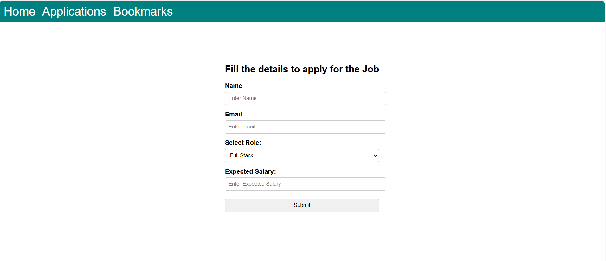
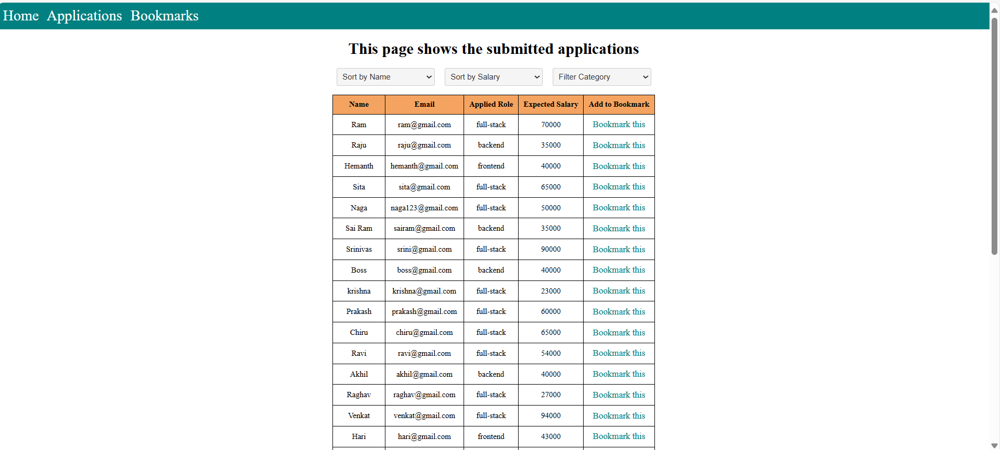
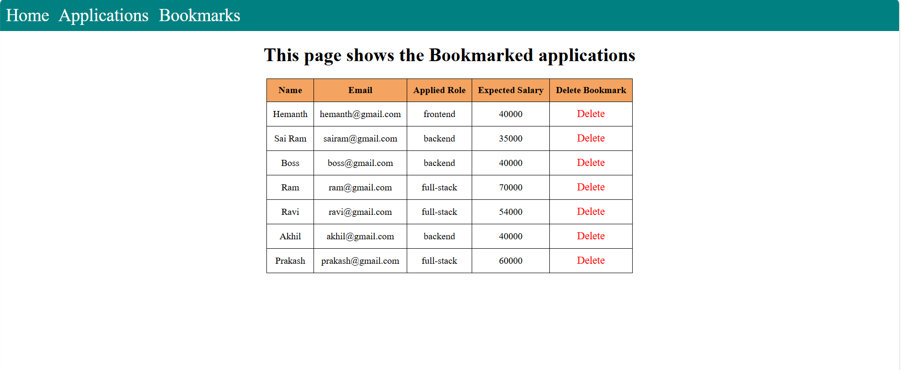

# Job-Application

This project allows user to fill the details to apply for Job and have an options to view the applications, can bookmark, delete, sort and filter based on the categories

## This Job Application consists of 3 Tabs as shown below

### Home Page

Allows user to fill the Job details in a form and submit

### Applications Page

Allows user to view the applied jobs

**Features of Applications Page**

- Sorting: Allows user to sort the data based on the name or salary in ascending and descending order
- Filter: Allows user to filter based on the category
- Bookmark: Allows user to select any particular application to Bookmark
  

### Bookmarks Page

**Features of Bookmarks Page**

- Allows user to view Bookmarked Applications
- Allows user to delete particular Bookmarks

